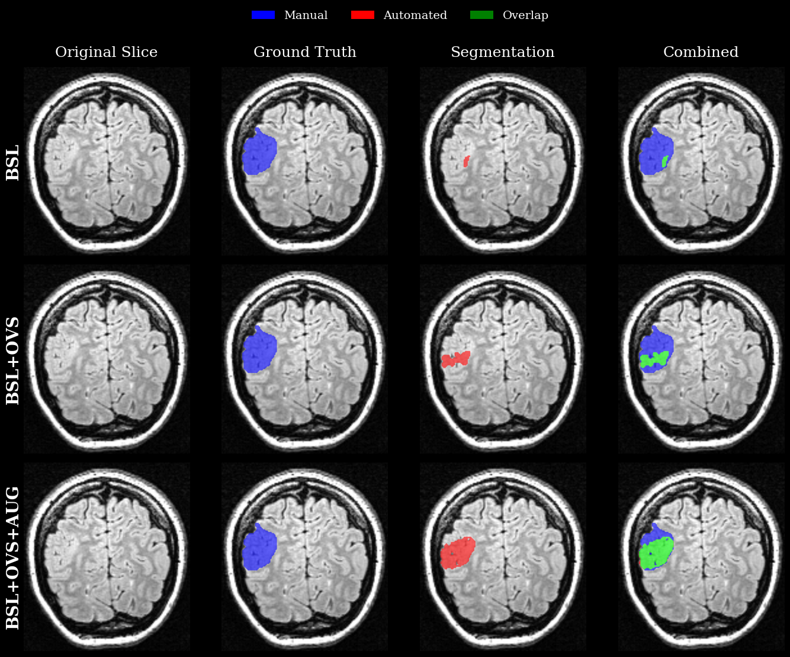

# Evaluation of nnU-Net for FCD II Lesions Segmentation in FLAIR MRI

[](LICENSE)
[](https://openneuro.org/datasets/ds004199)

**Official PyTorch Implementation** of the paper: *Evaluation of nnU-Net for FCD II Lesion Segmentation in FLAIR MRI*.

<p align="center">
  
  <br>
  <em>Figure: Overview of the proposed nnU-Net v2 pipeline.</em>
</p>

## Abstract

Epilepsy is one of the most common neurological disorders worldwide. Focal Cortical Dysplasia (FCD) is a major cause of drug-resistant epilepsy, often presenting as subtle lesions on MRI scans. While deep learning shows promise for automated FCD segmentation, existing methods achieved limited performance and used inconsistent dataset splits that prevent reproducible comparison. In this study, we propose an nnU-Net-based approach for automated FCD segmentation using the Bonn FCD Type II dataset. To improve model performance, our proposed approach employs oversampling of underrepresented FCD Type II radiological features and uses extensive augmentation during the training phase. We achieved an average validation Pseudo Dice of 0.56 compared to 0.45 in prior work, demonstrating significant performance improvement. This work provides the first complete evaluation on the dataset's standard train/test split, reporting both validation and test set performance to establish a reproducible benchmark for future method comparison. By providing both improved segmentation performance and a standardized evaluation framework, our work advances automated FCD segmentation toward better presurgical evaluation and improved outcomes for patients with drug-resistant epilepsy.

## Key Contributions

- **Reproducible Benchmark**: First complete evaluation on the Bonn FCD Type II dataset's standard train/test split, establishing a reliable baseline for future comparisons.
- **Improved Performance**: Achieved significant improvement in segmentation performance (Validation Pseudo Dice 0.56 vs. 0.45 in prior work) through radiological feature-based oversampling and extensive augmentation.
- **Radiological Feature-Awareness**: Addressed class imbalance by oversampling subtle and underrepresented radiological features (Transmantle Sign, Gray-White Matter Blurring).

## Methodology

### Pipeline Overview


- **Architecture**: nnU-Net (3d_fullres)
- **Data Splitting**: Adherence to the standard 57/28 train/test split to ensure reproducibility.
- **Preprocessing**: nnU-Net v2 automated preprocessing with resampling.
- **Radiological Feature-Based Sampling**: 3x oversampling for subjects with rare radiological features (Transmantle Sign, Gray-White Matter Blurring) to address class imbalance.
- **Extensive Augmentation**: Enhanced augmentation parameters to improve generalization:
    - **Rotation**: ±60°
    - **Scaling**: [0.70, 1.50]
    - **Brightness/Contrast**: [0.5, 1.5]
    - **Gaussian Noise**: $\sigma=0.2$
    - **Gamma**: [0.4, 2.0]

### Repository Structure

```
.
├── notebooks/
│   ├── 00_Dataset_Preparation.ipynb      # Common dataset setup
│   ├── proposed_method/                  # Proposed Method (OVS + Aug)
│   ├── baseline_oversampling_method/     # Ablation: Baseline + Oversampling
│   └── baseline_method/                  # Ablation: Baseline
├── src/
│   ├── config.py
│   └── nnunet_extensions/                # Shared custom Trainer & DataLoader
├── data/                # Dataset directory (Bonn FCD II)
├── figures/             # Generated figures and plots
├── results/             # Evaluation metrics and checkpoints
└── requirements.txt     # Python dependencies
```

## Getting Started

### Prerequisites

- Python 3.8+
- PyTorch 2.0+
- nnU-Net v2

### Installation

1. Clone the repository:
   ```bash
   git clone https://github.com/YassienTawfikk/nnU-FCD.git
   cd nnU-FCD
   ```

2. Install dependencies:
   ```bash
   pip install -r requirements.txt
   ```

### Data Setup

1. Download the [Bonn FCD II dataset](https://openneuro.org/datasets/ds004199).
2. Place the dataset in the `data/` directory.
3. Ensure `participants.tsv` is in `data/participants-data/`.

## Usage

The workflow is organized into separate experiments for reproducibility:

### Step 0: Data Setup
- Run `notebooks/00_Dataset_Preparation.ipynb` to download and preprocess the dataset.

### Experiment 1: Proposed Method (Best Performance)
The core contribution of the paper (Oversampling + Augmentation).
1. `notebooks/proposed_method/01_Train_Proposed_Model.ipynb`
2. `notebooks/proposed_method/03_Inference_Proposed.ipynb`

### Experiment 2: Baseline + Oversampling (Ablation)
Isolates the effect of radiological oversampling without extensive augmentation.
1. `notebooks/baseline_oversampling_method/01_Train_BSL_OVS_Model.ipynb`
2. `notebooks/baseline_oversampling_method/03_Inference_BSL_OVS.ipynb`

### Experiment 3: Baseline (Standard nnU-Net)
Standard nnU-Net training for performance comparison.
1. `notebooks/baseline_method/01_Train_Baseline_Model.ipynb`
2. `notebooks/baseline_method/03_Inference_Baseline.ipynb`

## Results

We evaluated our model on the standard train/test split.

### Ablation Study (Test Set)

Our ablation study demonstrates the progressive improvement of our contributions:

| Experiment | Best Val. PDS | Best Test DS |
| :--- | :---: | :---: |
| Baseline (BSL) | 0.545 | 0.168 |
| BSL + Oversampling (OVS) | 0.466 | 0.219 |
| **BSL + OVS + Augmentation (Proposed)** | **0.667** | **0.256** |

<p align="center">
  
  <br>
  <em>Figure: Qualitative improvements from Ablation Study. Row 1: Baseline. Row 2: +Oversampling. Row 3: +Augmentation (Proposed).</em>
</p>

### Comparison with State-of-the-Art (Standard Split)

| Method | Post-Processing | Mean Val. PDS | Best Val. PDS |
| :--- | :---: | :---: | :---: |
| Joshi et al. | CCA | 0.45 | 0.52 |
| **Proposed** | **None** | **0.54** | **0.65** |

*Note: Validation PDS (Pseudo Dice Score) is computed patch-wise during training/validation.*

## Citation

If you use this code or dataset split in your research, please cite our paper:

```bibtex
@article{Tawfik2024FCD,
  title={Evaluation of nnU-Net for FCD II Lesion Segmentation in FLAIR MRI},
  author={Tawfik, Yassien and Marwan, Mazen and Yasser, Mohamed and Mahmoud, Nancy and Mosaad, Madonna and Salman, Mahmoud and Basha, Tamer and Khalaf, Aya},
  journal={Department of Systems and Biomedical Engineering, Cairo University},
  year={2024}
}
```

## Authors

<div align="center">
  <table>
    <tr>
      <td align="center">
        <a href="https://medicine.yale.edu/profile/aya-khalaf/" target="_blank">
          
          <br/><br/>
          <sub><b>Dr. Aya Khalaf</b></sub>
        </a>
        <br/>
        <sub>Yale University</sub>
      </td>
    </tr>
  </table>
</div>
<br/>
<div align="center">
  <table>
    <tr>
      <td align="center">
        <a href="https://github.com/YassienTawfikk" target="_blank">
          
          <br/>
          <sub><b>Yassien Tawfik</b></sub>
        </a>
        <br/>
        <sub>Cairo University</sub>
      </td>
      <td align="center">
        <a href="https://github.com/mohamedddyasserr" target="_blank">
          
          <br/>
          <sub><b>Mohamed Yasser</b></sub>
        </a>
        <br/>
        <sub>Cairo University</sub>
      </td>
      <td align="center">
        <a href="https://github.com/nancymahmoud1" target="_blank">
          
          <br/>
          <sub><b>Nancy Mahmoud</b></sub>
        </a>
        <br/>
        <sub>Cairo University</sub>
      </td>
      <td align="center">
        <a href="https://github.com/Mazenmarwan023" target="_blank">
          
          <br/>
          <sub><b>Mazen Marwan</b></sub>
        </a>
        <br/>
        <sub>Cairo University</sub>
      </td>      
      <td align="center">
        <a href="https://github.com/madonna-mosaad" target="_blank">
          
          <br/>
          <sub><b>Madonna Mosaad</b></sub>
        </a>
        <br/>
        <sub>Cairo University</sub>
      </td>
    </tr>
  </table>
</div>
<br/>
<div align="center">
  <table>
    <tr>
      <td align="center">
        <a href="https://github.com/mahmoud1yaser" target="_blank">
          
          <br/>
          <sub><b>Mahmoud Salman</b></sub>
        </a>
        <br/>
        <sub>Western University</sub>
      </td>
    </tr>
  </table>
</div>
<br/>
<div align="center">
  <table>
    <tr>
      <td align="center">
        <a href="https://www.linkedin.com/in/tamer-basha-b81812ab/" target="_blank">
          
          <br/>
          <sub><b>Tamer Basha</b></sub>
        </a>
        <br/>
        <sub>Cairo University</sub>
      </td>
    </tr>
  </table>
</div>
